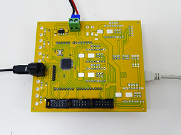
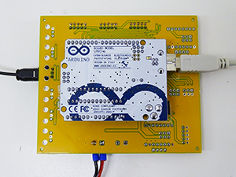
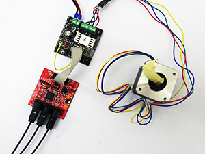
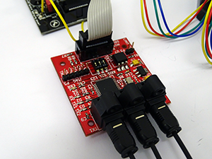

# ToslinkCNC

CNC machine is usually controlled via parallel bus, containing six signals. For each of the three axes there are two signals: STEP and DIR. At each positive edge of the STEP signal, the corresponding stepper motor moves into direction set by DIR signal. In addition to these six signals, there can also be other general purpose control signals.

Parallel bus on longer distances and in noisy environment can be susceptible to electromagnetic interferences. Because of this we decided to design an interface to transport these parallel signals via an optical link. For successful transfer via optical fiber the first thing that must be done is to convert parallel data to serial bit stream. Moreover, because of the inherent design of optical transmitters and receivers, serial data must also be Manchester encoded.

Our design is based on [Serializer / Deserializer for Audio Fiber Optic](http://opencores.org/project,parallel_io_through_fiber) project published on Open Cores. 

## Toslink Transmitter / Arduino Shield

We created universal PCB which can be used as a stand-alone stepper motor controller or as a shield attached to Arduino Uno. PCB consists of one CPLD, three optical transmitters, three optical receivers, headers for Arduino Uno and connectors for [Pololu's DRV8825 stepper motor driver carrier](https://www.pololu.com/product/2133) and for [PoLabs' PoStep25-32 driver](http://www.poscope.com/PoStep25-32). PCB can also be connected to [CNC USB Controller Mk3/4 from Planet CNC](http://www.planet-cnc.com/index.php?page=hardware) Shield enables cloning of one of the three axes. The axis to be cloned is set using jumpers Clone STP and Clone DIR. DRV8825 microstepping is being set using jumpers MicroStepJP X, Y, Z and A. There is also a header for connecting limit switches. Motors are being powered through terminal block J1 (+24V). Digital part of the circuit can be powered through terminal block J2 (+5V) or through Arduino Uno if attached as a shield. Toslink transmitter DLT1111 and Toslink receiver DLR1111 were used, which enable data transfer speed up to 16 Mbps. We used Xilinx XC9572XL CPLD to implement the necessary logic for protocol conversion.

## Toslink Receiver

For each motor on the CNC machine there is one PCB, containing Toslink receiver. Receiver PCB, together with motor driver, can be mounted on the motor. Receiver is being used with PoStep25-32 motor driver. PCB is being powered through motor driver connector using +5V. To enable this the +5V supply from motor driver should be connected to unused 9th pin on the driver's IDC connector usign a piece of isolated wire. PCB consists of one CPLD, two optical transmitters, one optical receiver, one DIP switch for selecting the axis and one limit switch connector, which is isolated through an optocoupler. Receivers can be connected in dasy chain.

##Known Isues

 * There is currently not enough room on the CPLD to hold both, the transmitter and the receiver. To enable transfer of limit switch signals from receivers back to transmitter, there would also need to be an additional optical receiver implemented on the transmitter PCB's CPLD.

---

#### License

All our projects are as usefully open-source as possible.

Hardware including documentation is licensed under [CERN OHL v.1.2. license](http://www.ohwr.org/licenses/cern-ohl/v1.2)

Firmware and software originating from the project is licensed under [GNU GENERAL PUBLIC LICENSE v3](http://www.gnu.org/licenses/gpl-3.0.en.html).

Open data generated by our projects is licensed under [CC0](https://creativecommons.org/publicdomain/zero/1.0/legalcode).

All our websites and additional documentation are licensed under [Creative Commons Attribution-ShareAlike 4 .0 Unported License] (https://creativecommons.org/licenses/by-sa/4.0/legalcode).

What this means is that you can use hardware, firmware, software and documentation without paying a royalty and knowing that you'll be able to use your version forever. You are also free to make changes but if you share these changes then you have to do so on the same conditions that you enjoy.

Koruza, GoodEnoughCNC and IRNAS are all names and marks of Institut IRNAS RaÄŤe. 
You may use these names and terms only to attribute the appropriate entity as required by the Open Licences referred to above. You may not use them in any other way and in particular you may not use them to imply endorsement or authorization of any hardware that you design, make or sell.
