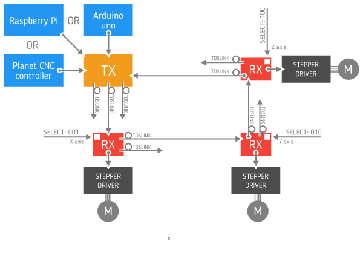
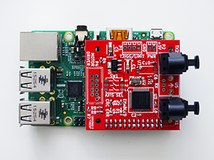

# ToslinkCNC

CNC machine is usually controlled via parallel bus, containing six signals. For each of the three axes there are two signals: STEP and DIR. At each positive edge of the STEP signal, the corresponding stepper motor moves into direction set by DIR signal. In addition to these six signals, there can also be other general purpose control signals.

Parallel bus on longer distances and in noisy environment can be susceptible to electromagnetic interferences. Because of this we decided to design an interface to transport these parallel signals via an optical link. For successful transfer via optical fiber the first thing that must be done is to convert parallel data to serial bit stream. Moreover, because of the inherent design of optical transmitters and receivers, serial data must also be Manchester encoded.

Our design is based on [Serializer / Deserializer for Audio Fiber Optic](http://opencores.org/project,parallel_io_through_fiber) project published on Open Cores. 

## Use cases
ToslinkCNC has been developed for use with [GoodenoughCNC Plasma](http://goodenoughcnc.eu) cutter as our answer to continuous problems with electrical noise and interference. The following configuration is used in the system. 

## Toslink Receiver-transceiver

For each motor on the CNC machine there is one PCB, containing Toslink receiver. Receiver PCB, together with motor driver, can be mounted on the motor. Receiver is being used with [PoLabs' PoStep25-32 stepper motor driver](http://www.poscope.com/PoStep25-32). PCB is being powered through motor driver connector using +5V. To enable this the +5V supply from motor driver should be connected to unused 9th pin on the driver's IDC connector usign a piece of insulated wire. PCB consists of one CPLD, two optical transmitters, one optical receiver, one DIP switch for selecting the axis and one limit switch / trigger connector. Limit switch is insulated through an optocoupler and trigger output is open drain type. Toslink transmitter DLT1111 and Toslink receiver DLR1111 were used, which enable data transfer speed up to 16 Mbps. We used Xilinx XC9572XL CPLD to implement the necessary logic for protocol conversion. Receivers can also be connected in daisy chain.

## Toslink Transmitter

Transmitter consists of two PCBs, an Arduino sield and a Toslink transciever. Both PCBs are stacked together. Toslink transciever PCB is identical to one used for receiver. Arduino shield consists of headers for Arduino, connectors for [CNC USB Controller Mk3/4 from Planet CNC](http://www.planet-cnc.com/index.php?page=hardware). There is also a terminal block for connecting limit switch and trigger signals. Circuit can be powered through terminal block (+5V), through Arduino Uno if attached as a shield, or from Planet CNC Controller.

## Toslink Transmitter / Arduino Shield

## Toslink Transmitter / Planet CNC

## Toslink Transmitter / Raspberry Pi Shield

## Firmware Description

All data is being transmitted in frames of fixed length. Frames are transmitted without gaps between them. Each frame contains 3 direction values, 3 step values, vaule of enable signal, 3 values of limit/end switch signals (these fields are being shared with 3 trigger values), odd and even parity bits and frame delimiter. To detect parity bit corruption, both even and odd parity bits are being transmitted.

##Known Isues

 * There is currently not enough room on the CPLD to hold both, the transmitter and the receiver. To enable transfer of limit switch signals from receivers back to transmitter, there would also need to be an additional optical receiver implemented on the transmitter PCB's CPLD.
 * Trigger signal inputs on transmitter need additional pull-up or pull-down resistors. It is an issue only if transmitter board is disconnected from Arduino, Raspberry PI or Planet CNC controller.

##Buy
You can order ToslinkCNC KIT from our partner company [Fabrikor](http://fabrikor.eu/index.php?route=product/category&path=60). 

---

#### License

All our projects are as usefully open-source as possible.

Hardware including documentation is licensed under [CERN OHL v.1.2. license](http://www.ohwr.org/licenses/cern-ohl/v1.2)

Firmware and software originating from the project is licensed under [GNU GENERAL PUBLIC LICENSE v3](http://www.gnu.org/licenses/gpl-3.0.en.html).

Open data generated by our projects is licensed under [CC0](https://creativecommons.org/publicdomain/zero/1.0/legalcode).

All our websites and additional documentation are licensed under [Creative Commons Attribution-ShareAlike 4 .0 Unported License] (https://creativecommons.org/licenses/by-sa/4.0/legalcode).

What this means is that you can use hardware, firmware, software and documentation without paying a royalty and knowing that you'll be able to use your version forever. You are also free to make changes but if you share these changes then you have to do so on the same conditions that you enjoy.

Koruza, GoodEnoughCNC and IRNAS are all names and marks of Institut IRNAS Rače. 
You may use these names and terms only to attribute the appropriate entity as required by the Open Licences referred to above. You may not use them in any other way and in particular you may not use them to imply endorsement or authorization of any hardware that you design, make or sell.
